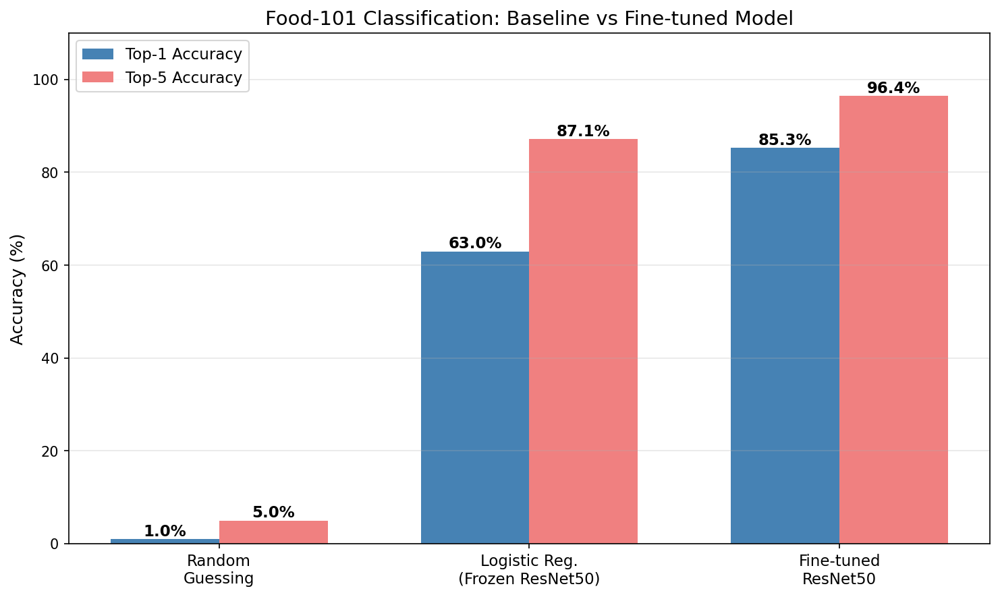
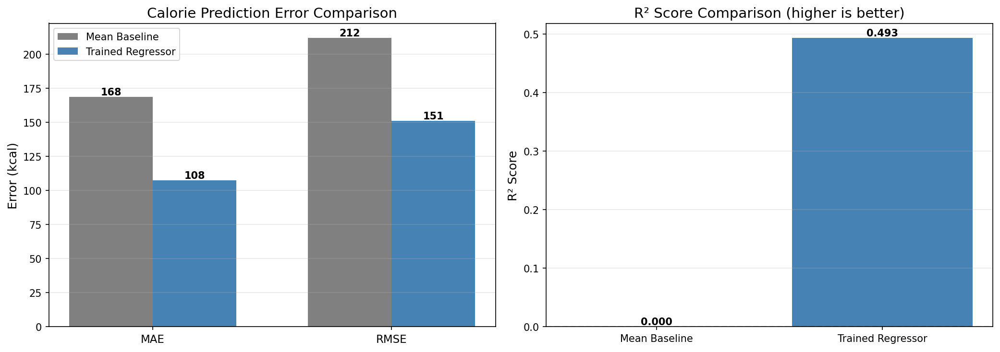
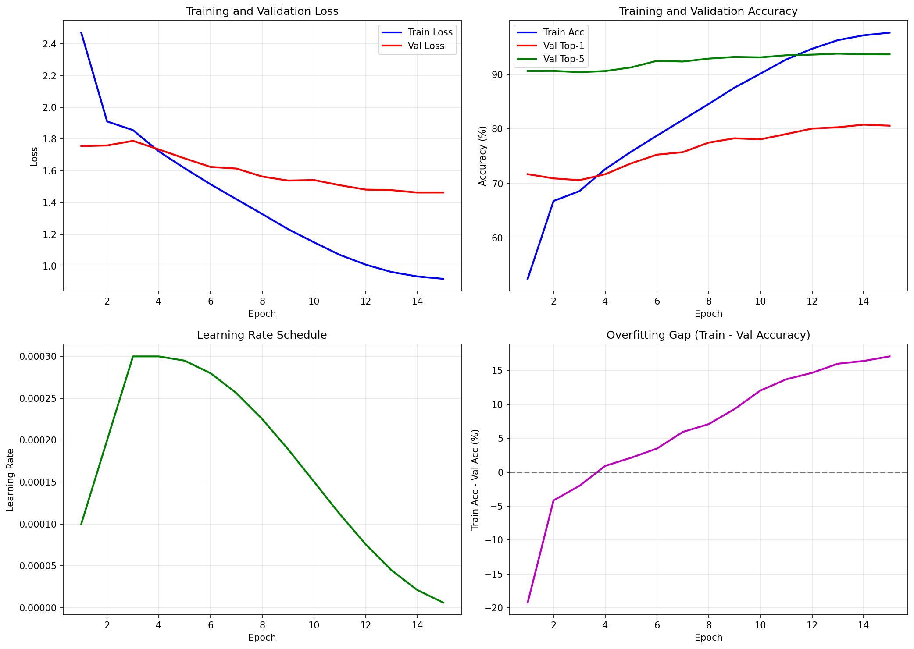
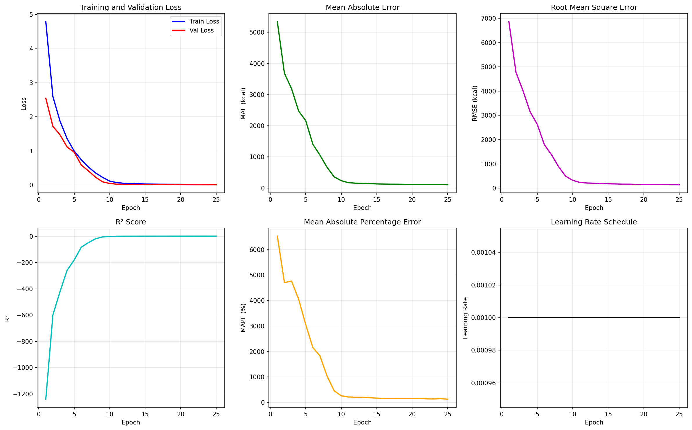

# AI Food Recognizer & Calorie Estimator

A dual-network deep learning system that classifies food images and estimates their calorie content using computer vision.

## What it Does

This project implements an end-to-end pipeline for nutritional analysis of food images. Given an image of food, the system first classifies it into one of 101 food categories using a fine-tuned ResNet50 classifier trained on the Food-101 dataset, achieving 85.27% top-1 accuracy. Next, a separate regression network trained on the Nutrition5k dataset estimates the calorie content of the meal, achieving a mean absolute error of 107.5 kcal. The pipeline combines both networks to provide users with the predicted food type, classification confidence, and estimated calories in a single inference.
## Project Structure
```
Final Project/
├── artifacts/
│   ├── class_logs/
│   ├── figures/
│   ├── models/
│   └── reg_logs/
│
├── data/
│   └── nutrition5k/
│       ├── imagery/
│       ├── metadata/
│       └── splits/
│
├── mnt/
│
└── src/
    ├── data/
    ├── models/
    ├── notebooks/
    └── pipeline/
```
## Quick Start Using Google Colab

1. Clone the repo and download the large files using the following commands.
```
git lfs install
git lfs pull
```   
2. Upload the repo to Google Drive 
3. Open a notebook in Google Colab
4. Run the setup cell to mount Google Drive and install dependencies:
```python
from google.colab import drive
drive.mount('/content/drive')
import sys, os
PROJECT_ROOT = '/content/drive/MyDrive/CompSci_372_Final_Project-main'  
sys.path.insert(0, os.path.join(PROJECT_ROOT, 'src'))
os.chdir(PROJECT_ROOT)

!pip install -q torch torchvision timm grad-cam tensorboard tqdm gradio
```

3. Load the pipeline and run predictions:
```python
import sys
sys.path.insert(0, 'src')
from pipeline import FoodCaloriePipeline

pipeline = FoodCaloriePipeline(
    classifier_path="artifacts/models/classifier_best.pth",
    regressor_path="artifacts/models/regressor_best.pth",
)

result = pipeline.predict("path/to/food/image.jpg")
print(f"Food: {result['class_name']}")
print(f"Confidence: {result['confidence']:.1%}")
print(f"Calories: {result['calories']:.0f} kcal")
```

### Web Demo (Gradio)

```python
!pip install -q gradio
import gradio as gr
from pipeline import FoodCaloriePipeline

pipeline = FoodCaloriePipeline(
    classifier_path="artifacts/models/classifier_best.pth",
    regressor_path="artifacts/models/regressor_best.pth",
)

def predict(image):
    result = pipeline.predict(image)
    return f"Food: {result['class_name'].replace('_', ' ').title()}\nConfidence: {result['confidence']:.1%}\nCalories: {result['calories']:.0f} kcal"

gr.Interface(fn=predict, inputs=gr.Image(type="filepath"), outputs="text").launch(share=True)
```

## Video Links

| Video | Link |
|-------|------|
| Demo Video | https://youtu.be/aivXjzxfl1I |
| Technical Walkthrough | https://youtu.be/hwiC5q3Ppc0 |


## Evaluation

### Food Classification (Food-101 Dataset)

| Model | Top-1 Accuracy | Top-5 Accuracy |
|-------|----------------|----------------|
| Random Guessing | 0.99% | 4.95% |
| Logistic Regression (Frozen ResNet50) | 62.95% | 87.11% |
| **Fine-tuned ResNet50 (Ours)** | **85.27%** | **96.42%** |



### Calorie Estimation (Nutrition5k Dataset)

| Model | MAE (kcal) | RMSE (kcal) | R² |
|-------|------------|-------------|-----|
| Mean Baseline | 168 | 212 | 0.000 |
| **Trained Regressor (Ours)** | **107.5** | **150.8** | **0.493** |



### Training Curves

The classifier achieved convergence after approximately 14 epochs with clear improvement over the baseline:



The regressor showed steady improvement in MAE throughout training but hit a plateau around 15 epochs.



### Limitations and Out of Domain Images
- The model can only classify data into the 101 classes in food 101
- The calorie estimation inherently inaccurate for the following reasons
  - non visual features that are highly impactful
    - oil type (olive is is less calorie dense than vegitable oil)
    - fillings (if a croissant has a filling, it may not be visible in an overhead shot)
  - Calorie estimation was trained on only 5000 images, and of those not all had accurate calorie information
  - No targeted way of learning portion size
- The model requires overhead shots for accurate classification and estimation, as it was mainly trined on overhead shots
- A key limitation is the domain gap: the classifier was trained on web photos while the regressor was trained on overhead cafeteria images. We addressed this partially by using pretrained ImageNet features, which provide domain-agnostic visual representations. However, we evaluated each network on its own domain rather than making cross-domain claims. Bridging this gap through domain adaptation is future work.
## Individual Contributions

| Team Member | Contributions |
|-------------|---------------|
| Maanav | Full project implementation: data pipeline development, model architecture design, training scripts, baseline comparisons, evaluation metrics, pipeline integration, and documentation |
